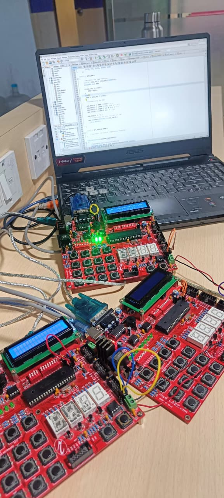
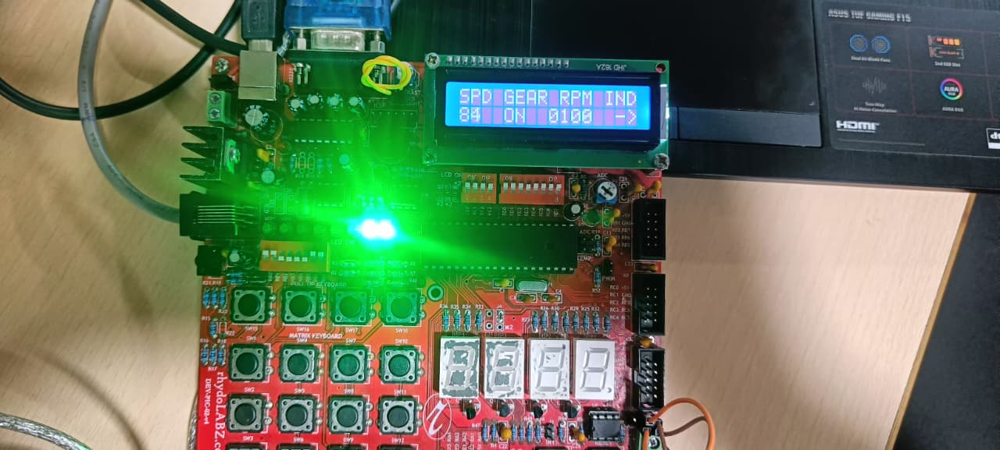

# 🚗 CAN Based Automation Dashboard System

## 📌 Overview

This project implements a **multi-node embedded dashboard system** using the **CAN (Controller Area Network) protocol**. It simulates automotive ECU communication by transmitting real-time parameters like **speed, gear position, RPM, and indicator status** between nodes.

---

## ⚙️ Features

* Real-time **Speed Monitoring (ADC-based)**
* **Gear Position Detection (Switch input)**
* **RPM Calculation (ADC scaling)**
* **Indicator Control (Left/Right/Off)**
* **CAN Communication (Message-based Tx/Rx)**
* **CLCD & 7-Segment Display Interface**
* Modular driver-based architecture

---

## 🧠 System Architecture

### 🔹 ECU1 (Sensor Node)

* Reads speed using ADC
* Detects gear position
* Transmits data via CAN

### 🔹 ECU2 (Control Node)

* Calculates RPM from ADC
* Controls indicators
* Transmits RPM & indicator status

### 🔹 ECU3 (Dashboard Node)

* Receives CAN messages
* Decodes message IDs
* Displays data on CLCD
* Controls indicator LEDs

---

## 🔁 Data Flow

Sensor Input → Microcontroller → CAN Tx → CAN Bus → CAN Rx → Dashboard Display

---

## 🔌 Hardware Components

* PIC Microcontroller
* MCP2515 CAN Module
* CLCD Display
* 7-Segment Display (SSD)
* Potentiometer (Speed/RPM input)
* Switches (Gear & Indicator control)

---

## 🛠️ Technologies Used

* Embedded C
* MPLAB X IDE
* CAN Protocol (CAN 2.0)
* UART (Debugging)

---

## 📂 Project Structure

* `ECU1.X/` → Speed & gear node
* `ECU2.X/` → RPM & indicator node
* `ECU3.X/` → Dashboard node
* `images/` → Project images
* `README.md`

---

## 📸 Output

### 🔌 Hardware Setup

### 🖥️ CLCD Display Output

---

## 🚀 How to Run

1. Open project in **MPLAB X IDE**
2. Build and flash each ECU code to respective PIC
3. Connect CAN modules between nodes
4. Power ON system
5. Observe real-time dashboard output

---

## 📈 Future Improvements

* ESP8266 integration for IoT dashboard
* Cloud data logging
* Fault detection system
* Mobile app monitoring

---

## 👨‍💻 Author

**Nakul Anil Vadar**

---
